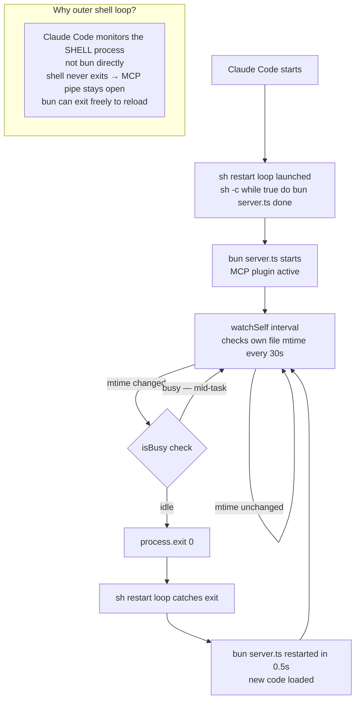
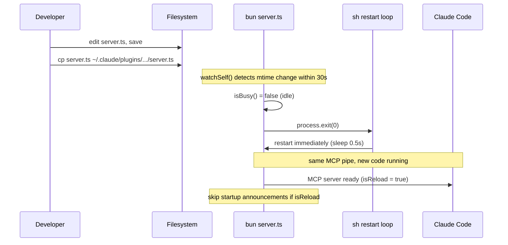

# mcp-self-reload

Zero-downtime code rolls for bun-based MCP plugins.


> Part of [The Agent Crafting Table](https://github.com/Agent-Crafting-Table) — standalone Claude Code agent components.

## How It Works





## The Problem

When Claude Code starts an MCP plugin (`bun server.ts`), it owns the process. If the plugin exits to reload new code, Claude Code's MCP supervisor is supposed to restart it — but the supervisor is unreliable. It can take minutes to restart, or silently fail, leaving the plugin dead with no Discord messages getting through.

## How This Solves It

Use a **bash restart loop** as the outer process Claude Code monitors. Claude Code's pipe stays connected to the outer shell process (which never exits). When bun exits to reload, the shell immediately restarts it — no gap, no supervisor dependency.

```
File changes on disk
        ↓
watchSelf() detects new mtime → process.exit(0)
        ↓
sh restart loop catches the exit
        ↓
bun server.ts restarted in 0.5s  ← same MCP pipe, new code
```

## Setup

Add this to your `package.json` start script. **Important:** use `sh -c` — bun's built-in shell (`--shell=bun`) doesn't support `while/do/done` loops.

```json
{
  "scripts": {
    "start": "bun install --no-summary && sh -c 'while true; do bun server.ts; sleep 0.5; done'"
  }
}
```

## Usage

```typescript
import { watchSelf, isReload } from 'mcp-self-reload/src/watch.ts'

// ... set up your MCP server ...

// At the end of setup, start watching
watchSelf({
  intervalMs: 30_000,   // check every 30s (default)
  isBusy: () => false,  // optional: defer if mid-task
})
```

The `isBusy` option is key for plugins that shouldn't interrupt in-flight work:

```typescript
let handling = false
server.tool('reply', '...', { text: z.string() }, async ({ text }) => {
  handling = true
  try {
    // ... do work ...
  } finally {
    handling = false
  }
})

watchSelf({ isBusy: () => handling })
```

## isReload flag

```typescript
import { isReload } from 'mcp-self-reload/src/watch.ts'

if (isReload) {
  // This process was restarted by the outer loop, not Claude Code's first boot
  // Useful for skipping startup announcements, re-pairing flows, etc.
}
```

## Deploy workflow

Pair this with a file-sync script. Example:

```bash
# 1. Edit your server.ts
# 2. Sync to Claude Code's plugin directory
cp server.ts ~/.claude/plugins/cache/my-plugin/0.0.1/server.ts
# 3. watchSelf() detects the mtime change within 30s and exits
# 4. The sh restart loop immediately relaunches with the new code
```

For multi-session fleets, use [fleet-discord](https://github.com/Agent-Crafting-Table/fleet-discord)'s `fleet-sync-plugin.sh` to sync across all session plugin dirs simultaneously.

## Why not spawn-handoff?

An earlier approach tried spawning a replacement bun process with inherited stdio before exiting. This doesn't work: Claude Code closes the pipe when the original process it spawned exits, which kills the replacement too. The outer shell loop avoids this because the shell (not bun) is what Claude Code monitors.

## Why not `bun --hot`?

`bun --hot` does hot module replacement in-process but requires special structuring for cleanup (`import.meta.hot.dispose`). For MCP servers, the stdio transport setup needs to stay intact through reloads, which makes hot reloading fragile.
